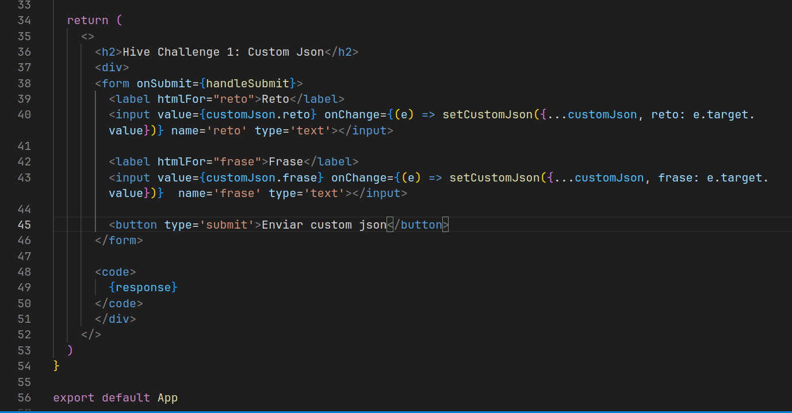

# HIVE CHALLENGE: CUSTOM JSON

## Idea

The idea is to use a simple form structure with a basic react project to enter the challenge and phrase field and then with a button broadcast it in a custom json to the blockchain. Using hive keychain to avoid the handling of the keys in the code.  

Note: you will need very basic React understanding to follow
## Execution

Note: I was taking screenshoots through the process so the img files appear in the screenshoots. 

### 1. Scaffold of the project and a little cleaning

### 2. Building the basic structure with react

### 3. Using Keychain

Hive Keychain is a powerfull tool that enables us to manage Hive private keys, you can read about the project here. For the purpose of this example, Keychain helps us handling the keys in the device, then, we only need to ask the extension to make the operation, in this case custom json, and it will use the keys saved by the device/browser user. If the person does not have Hive Keychain, we would need to manage the keys directly or with hivesigner, etc. In this example it would only throw a Error indicating that this app needs Hive Keychain

This is the important part, following the [docs of Hive Keychain](https://github.com/hive-keychain/hive-keychain-extension/tree/master/documentation#requestcustomjson) we will need an operation id, the key type that enables us to perform this operation, in this case the Posting key, the json (in this case we got it from the state binded to the form), a message, and then we have a callback with the response of the blockchain. I'm not sure why it is in this way, we could wrap this operations in more classical promises, but it works nicely. We update the state and print the response in the code, below is the form structure:

Then we only need to run the project. 

### 3. Results

Running the project with npm

We enter the challenge name and the phrase

Then we hit the button

We enter the local password of Keychain

Keychain will need our confirmation to make the operation, and it will show the details there. Also, in the background there is an error message cuz I clicked the cancel button accidentally jeje.

We hit the confirm button and then we are done. He have succesfully broadcasted a custom json to the blockchain

Here is the message: 

<code> 
{"success":true,"result":{"id":"2bddc42d0a36c80371eb6076cbd277efd2ac2556","tx_id":"2bddc42d0a36c80371eb6076cbd277efd2ac2556","confirmed":false},"data":{"type":"custom","username":"jkalthor","id":"hive-challenge-custom-json","method":"Posting","json":"{\"reto\":\"HiveDevChallenge\",\"frase\":\"Ama a todos, sirve a todos\"}","display_msg":"Hive Challenge Custom Json by @Jkalthor"},"message":"The transaction has been broadcasted successfully.","request_id":2}
</code>

 

[https://hivehub.dev/tx/2bddc42d0a36c80371eb6076cbd277efd2ac2556](https://hivehub.dev/tx/2bddc42d0a36c80371eb6076cbd277efd2ac2556)

### For the sake of recursion

Finally, I took screenshots of the making of this post while making it to show how it was made in itself, just cuz is fun.

And here is the repository